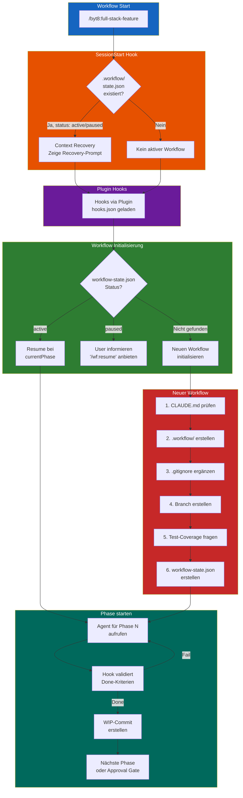

# byt8 Plugin

**Version 6.3.0** | Full-Stack Development Toolkit für Angular 21 + Spring Boot 4 Anwendungen mit 10-Phasen Workflow, Approval Gates und **kontinuierlichem Auto-Advance**.

## Philosophy

> "Qualität durch Struktur: Jede Phase wird abgeschlossen, bevor die nächste beginnt."

Dieses Plugin orchestriert spezialisierte Agents durch einen strukturierten Entwicklungs-Workflow mit Quality Gates und User Approvals.

### Workflow-Steuerung

Das Plugin nutzt eine **hybride Workflow-Kontrolle** aus Hooks und SKILL-Logik:

```
┌─────────────────────────────────────────────────────────────┐
│  1. User ruft /byt8:full-stack-feature auf                  │
│  2. SKILL führt Phasen aus bis zum nächsten Approval Gate   │
│  3. Stop-Hook validiert und gibt Anweisungen                │
│  4. User gibt Approval oder Feedback                        │
│  5. Nächster Aufruf → weiter bis zum nächsten Gate          │
└─────────────────────────────────────────────────────────────┘
```

**Kernprinzip:** Approval Gates (0, 1, 7, 8, 9) pausieren für User-Input. Auto-Advance Phasen (2-6) laufen ohne Stopp durch. Der Stop-Hook kontrolliert den Workflow, nicht Claude.

---

## Installation

### Via Marketplace

```bash
# In Claude Code
/plugins install byt8
```

### Via GitHub

Füge in deinem Projekt `.claude/settings.json` hinzu:

```json
{
  "extraKnownMarketplaces": {
    "byteagenten-marketplace": {
      "source": {
        "source": "github",
        "repo": "byteAgenten/byteagenten-marketplace"
      }
    }
  },
  "enabledPlugins": {
    "byt8@byteagenten-marketplace": true
  }
}
```

---

## MCP Server

Das Plugin installiert zwei MCP Server automatisch:

| Server | Beschreibung |
|--------|--------------|
| `context7` | Aktuelle Dokumentation für Libraries (von [Upstash](https://github.com/upstash/context7)) |
| `angular-cli` | Angular CLI Integration |

**Wichtig:** Nach der Plugin-Installation muss Claude Code **neu gestartet** werden, damit die MCP Server geladen werden.

### Context7 API-Key (optional, empfohlen)

Context7 funktioniert ohne Anmeldung, aber mit eingeschränkten Rate Limits. Für häufige Nutzung empfehlen wir einen kostenlosen API-Key:

1. Registrieren auf [context7.com/dashboard](https://context7.com/dashboard)
2. API-Key generieren (Format: `ctx7sk-...`)
3. Als Umgebungsvariable setzen:

```bash
# In ~/.bashrc oder ~/.zshrc einfügen:
export CONTEXT7_API_KEY=ctx7sk-dein-key-hier
```

---

## Commands

| Command | Beschreibung |
|---------|--------------|
| `/byt8:full-stack-feature` | 10-Phasen Feature Development Workflow |
| `/byt8:ui-theming` | Einmalige Design System Initialisierung |
| `/byt8:python-expert` | Python Development Support |

### Beispiele

```bash
# Mit GitHub Issue
/byt8:full-stack-feature #42                          # Fragt nach Branch
/byt8:full-stack-feature #42 --from=develop           # Branch explizit

# Mit direkter Featurebeschreibung (ohne GitHub)
/byt8:full-stack-feature "User kann sich ausloggen"   # Fragt nach Branch
/byt8:full-stack-feature "Logout Button" --from=main  # Branch explizit

# Mit Datei (für längere Specs)
/byt8:full-stack-feature --file=feature.md            # Fragt nach Branch
/byt8:full-stack-feature --file=feature.md --from=develop
```

**Hinweis:** Ohne `--from=` fragt der Workflow immer nach dem Quell-Branch.

---

## Der 10-Phasen Workflow

Der `full-stack-feature` Command orchestriert diese Phasen:

| Phase | Agent | Aufgabe |
|-------|-------|---------|
| 0 | architect-planner | Technical Specification erstellen |
| 1 | ui-designer | Wireframes erstellen |
| 2 | api-architect | API Design (OpenAPI 3.1) |
| 3 | postgresql-architect | Database Migrations (Flyway) |
| 4 | spring-boot-developer | Backend Implementation + Tests |
| 5 | angular-frontend-developer | Frontend Implementation + Tests |
| 6 | test-engineer | E2E Tests (Playwright) |
| 7 | security-auditor | Security Audit |
| 8 | code-reviewer | Code Review |
| 9 | - (Orchestrator) | Push & PR erstellen |

### Approval Gates

Der Workflow pausiert an kritischen Punkten für User-Approval:
- Nach Phase 0 (Technical Spec)
- Nach Phase 1 (Wireframes)
- Nach Phase 7 (Security Audit)
- Nach Phase 8 (Code Review)
- Nach Phase 9 (PR erstellt)

---

## Hook-basierte Automatisierung (v4.0+)

Ab Version 4.0 nutzt byt8 **Workflow Hooks** für zuverlässige Automatisierung. Dies löst viele Probleme des rein prompt-gesteuerten Workflows.

### Vorteile gegenüber Prompt-Steuerung

| Problem (früher) | Lösung (mit Hooks) |
|------------------|-------------------|
| Context Overflow → Workflow-Zustand verloren | **SessionStart Hook** stellt automatisch den kompletten Kontext wieder her |
| Agent vergisst WIP-Commit | **SubagentStop Hook** erstellt automatisch WIP-Commits nach jeder Phase |
| Tests fehlgeschlagen aber weitergemacht | **Stop Hook** validiert Done-Kriterien und blockiert bei Fehler |
| Retry-Chaos nach Testfehlern | Automatisches **Retry-Management** mit Max 3 Versuchen |
| Approval Gate übersprungen | Hooks erzwingen **Approval Gates** an kritischen Punkten |

### Die 3 Workflow Hooks

| Hook | Trigger | Script | Funktion |
|------|---------|--------|----------|
| `SessionStart` | Session-Start/Resume | `session_recovery.sh` | Context Recovery nach Overflow |
| `Stop` | Haupt-Agent fertig | `wf_engine.sh` | Phase Validation, Retry-Management |
| `SubagentStop` | Subagent beendet | `subagent_done.sh` | **WIP-Commits**, Agent-Info, Output Validation |

### Setup

Hooks werden automatisch über die Plugin-Konfiguration (`hooks/hooks.json`) geladen - **kein manuelles Setup nötig**.

Falls bereits Project-Hooks in `.claude/settings.json` existieren (aus älteren Versionen), sollten diese entfernt werden um doppeltes Feuern zu vermeiden:

```bash
# Alte Project-Hooks entfernen (falls vorhanden)
/byt8:remove-hooks
```

### Startup-Flow & Hook-Initialisierung

Das folgende Diagramm zeigt, wie der Workflow startet und wie die Hooks automatisch eingerichtet werden:



**Ablauf im Detail:**

1. **SessionStart Hook feuert** bei jedem Session-Start/Resume
2. **Plugin Hooks** werden automatisch via `hooks.json` geladen
3. **Workflow-Status** bestimmt ob Resume, Pause-Info oder Neustart
4. **Neuer Workflow** durchläuft vollständige Initialisierung
5. **Phasen-Loop** wird von Stop/SubagentStop Hooks gesteuert

### Was die Hooks tun

**session_recovery.sh** (SessionStart):
- Erkennt aktiven Workflow nach Context Overflow
- Gibt vollständigen Recovery-Prompt mit allem Kontext aus
- Zeigt Status, abgeschlossene Phasen, nächsten Schritt
- **Kein Auto-Setup von Project-Hooks** (verhindert Doppel-Ausführung)

**wf_engine.sh** (Stop):
- Prüft Done-Kriterien für aktuelle Phase (z.B. Tests bestanden?)
- Erstellt WIP-Commits für commitbare Phasen (1, 3, 4, 5, 6)
- Verwaltet Retry-Counter für Test-Phasen
- Pausiert nach 3 fehlgeschlagenen Versuchen
- Erzwingt Approval Gates

**subagent_done.sh** (SubagentStop):
- **Erstellt WIP-Commits** für commitbare Phasen (1, 3, 4, 5, 6)
- Zeigt sichtbare Ausgabe welcher Agent fertig ist
- Validiert Agent-Output (z.B. Dateien vorhanden?)
- Loggt alle Agent-Aktivitäten

### Workflow-State

Der Zustand wird in `.workflow/` persistiert:

```
.workflow/
├── workflow-state.json    # Hauptzustand (Phase, Status, Context)
├── context/               # Phase-Snapshots für Recovery
│   ├── phase-0-spec.json
│   ├── phase-1-wireframes.json
│   └── ...
├── recovery/              # Recovery-Daten
│   ├── retry-tracker.json
│   └── last-checkpoint.json
└── logs/                  # Audit-Logs
    ├── hooks.log
    └── transitions.jsonl
```

### Workflow-Commands

| Command | Beschreibung |
|---------|--------------|
| `/byt8:wf-status` | Detaillierten Workflow-Status anzeigen |
| `/byt8:wf-pause` | Workflow pausieren |
| `/byt8:wf-resume` | Pausierten Workflow fortsetzen |
| `/byt8:wf-retry-reset` | Retry-Counter zurücksetzen |
| `/byt8:wf-skip` | ⚠️ Phase überspringen (Notfall) |

---

## Agents

| Agent | Spezialisierung |
|-------|-----------------|
| `architect-planner` | Technical Specifications, 5x Warum Analyse |
| `api-architect` | OpenAPI 3.1, REST API Design |
| `angular-frontend-developer` | Angular 21, Signals, TypeScript |
| `spring-boot-developer` | Spring Boot 4, Java 21, JPA |
| `postgresql-architect` | Schema Design, Flyway Migrations |
| `test-engineer` | JUnit 5, Jasmine, Playwright |
| `ui-designer` | Wireframes, Design Tokens |
| `security-auditor` | OWASP Top 10, Security Best Practices |
| `code-reviewer` | Code Quality, Architecture Review |
| `architect-reviewer` | Architecture Decisions |

---

## Skills

| Skill | Beschreibung |
|-------|--------------|
| `full-stack-feature` | 10-Phasen Workflow mit State Management |
| `ui-theming` | Design System Initialisierung (inkl. 10 vordefinierte Themes) |
| `python-expert` | Async, Typing, Testing Patterns |

---

## Plugin-Struktur

```
byt8/
├── .claude-plugin/
│   └── plugin.json
├── agents/                    # 10 spezialisierte Agents
│   ├── architect-planner.md
│   ├── angular-frontend-developer.md
│   ├── spring-boot-developer.md
│   └── ...
├── commands/                  # Slash-Commands
│   ├── full-stack-feature.md
│   ├── ui-theming.md
│   └── ...
├── hooks/                     # Hook-Konfiguration (v4.0+)
│   └── hooks.json
├── scripts/                   # Workflow-Scripts (v4.0+)
│   ├── wf_engine.sh           # Phase Validation & Auto-Commits
│   ├── subagent_done.sh       # Subagent Output Handling
│   ├── session_recovery.sh    # Context Recovery
│   └── setup_hooks.sh         # Hook Setup Helper
├── skills/                    # Workflow-Implementierungen
│   ├── full-stack-feature/
│   │   └── SKILL.md
│   ├── ui-theming/
│   │   ├── SKILL.md
│   │   └── themes/
│   └── ...
└── README.md
```

---

## Technologie-Stack

- **Backend:** Spring Boot 4.0+, Java 21+, PostgreSQL
- **Frontend:** Angular 21+, TypeScript, SCSS
- **Testing:** JUnit 5, Jasmine, Playwright
- **API:** OpenAPI 3.1, REST
- **Database:** PostgreSQL, Flyway Migrations

---

## License

MIT
