# byt8 Plugin

**Version 7.5.2** | Full-Stack Development Toolkit für Angular 21 + Spring Boot 4 Anwendungen mit 10-Phasen Workflow, Approval Gates und **deterministischem Auto-Advance via Context-Injection**.

## Philosophy

> "Qualität durch Struktur: Jede Phase wird abgeschlossen, bevor die nächste beginnt."

Dieses Plugin orchestriert spezialisierte Agents durch einen strukturierten Entwicklungs-Workflow mit Quality Gates und User Approvals.

### Workflow-Steuerung

Das Plugin nutzt eine **hybride Workflow-Kontrolle** aus Hooks und SKILL-Logik:

```
┌─────────────────────────────────────────────────────────────┐
│  1. User ruft /byt8:full-stack-feature auf                  │
│  2. SKILL führt Phasen aus bis zum nächsten Approval Gate   │
│  3. Stop-Hook validiert und gibt Anweisungen                │
│  4. User gibt Approval oder Feedback                        │
│  5. Nächster Aufruf → weiter bis zum nächsten Gate          │
└─────────────────────────────────────────────────────────────┘
```

**Kernprinzip:** Approval Gates (0, 1, 7, 8, 9) pausieren für User-Input. Auto-Advance Phasen (2-6) laufen ohne Stopp durch. Der Stop-Hook kontrolliert den Workflow, nicht Claude.

---

## Installation

### Via Marketplace

```bash
# In Claude Code
/plugins install byt8
```

### Via GitHub

Füge in deinem Projekt `.claude/settings.json` hinzu:

```json
{
  "extraKnownMarketplaces": {
    "byteagenten-marketplace": {
      "source": {
        "source": "github",
        "repo": "byteAgenten/byteagenten-marketplace"
      }
    }
  },
  "enabledPlugins": {
    "byt8@byteagenten-marketplace": true
  }
}
```

---

## MCP Server

Das Plugin installiert zwei MCP Server automatisch:

| Server | Beschreibung |
|--------|--------------|
| `context7` | Aktuelle Dokumentation für Libraries (von [Upstash](https://github.com/upstash/context7)) |
| `angular-cli` | Angular CLI Integration |

**Wichtig:** Nach der Plugin-Installation muss Claude Code **neu gestartet** werden, damit die MCP Server geladen werden.

### Context7 API-Key (optional, empfohlen)

Context7 funktioniert ohne Anmeldung, aber mit eingeschränkten Rate Limits. Für häufige Nutzung empfehlen wir einen kostenlosen API-Key:

1. Registrieren auf [context7.com/dashboard](https://context7.com/dashboard)
2. API-Key generieren (Format: `ctx7sk-...`)
3. Als Umgebungsvariable setzen:

```bash
# In ~/.bashrc oder ~/.zshrc einfügen:
export CONTEXT7_API_KEY=ctx7sk-dein-key-hier
```

---

## Commands

| Command | Beschreibung |
|---------|--------------|
| `/byt8:full-stack-feature` | 10-Phasen Feature Development Workflow |
| `/byt8:ui-theming` | Einmalige Design System Initialisierung |
| `/byt8:python-expert` | Python Development Support |
| `/byt8:prd-generator` | PRD erstellen (User Stories + Requirements → GitHub Issue) |

### Beispiele

```bash
# Mit GitHub Issue
/byt8:full-stack-feature #42                          # Fragt nach Branch
/byt8:full-stack-feature #42 --from=develop           # Branch explizit

# Mit direkter Featurebeschreibung (ohne GitHub)
/byt8:full-stack-feature "User kann sich ausloggen"   # Fragt nach Branch
/byt8:full-stack-feature "Logout Button" --from=main  # Branch explizit

# Mit Datei (für längere Specs)
/byt8:full-stack-feature --file=feature.md            # Fragt nach Branch
/byt8:full-stack-feature --file=feature.md --from=develop
```

**Hinweis:** Ohne `--from=` fragt der Workflow immer nach dem Quell-Branch.

---

## Der 10-Phasen Workflow

Der `full-stack-feature` Command orchestriert diese Phasen:

| Phase | Agent | Aufgabe |
|-------|-------|---------|
| 0 | architect-planner | Technical Specification erstellen |
| 1 | ui-designer | Wireframes erstellen |
| 2 | api-architect | API Design (OpenAPI 3.1) |
| 3 | postgresql-architect | Database Migrations (Flyway) |
| 4 | spring-boot-developer | Backend Implementation + Tests |
| 5 | angular-frontend-developer | Frontend Implementation + Tests |
| 6 | test-engineer | E2E Tests (Playwright) |
| 7 | security-auditor | Security Audit |
| 8 | code-reviewer | Code Review |
| 9 | - (Orchestrator) | Push & PR erstellen |

### Approval Gates

Der Workflow pausiert an kritischen Punkten für User-Approval:
- Nach Phase 0 (Technical Spec)
- Nach Phase 1 (Wireframes)
- Nach Phase 7 (Security Audit)
- Nach Phase 8 (Code Review)
- Nach Phase 9 (PR erstellt)

---

## Hook-basierte Automatisierung (v4.0+, Context-Injection v7.0)

Ab Version 7.0 nutzt byt8 **Context-Injection** für deterministische Workflow-Steuerung. Hooks kommunizieren mit Claude über dokumentierte Kanäle statt unsichtbarem stdout.

### Hook-Output-Sichtbarkeit (Claude Code Architektur)

| Output-Kanal | Sieht Claude? | Sieht User? | Genutzt für |
|---|---|---|---|
| `Stop` Hook: JSON `decision:"block"` + `reason` | **Ja** (reason) | Ja | Auto-Advance, Retries |
| `UserPromptSubmit` Hook: stdout | **Ja** (Context) | Verbose | Approval Gate Kontext |
| `SessionStart` Hook: stdout | **Ja** (Context) | Verbose | Context Recovery |
| `PreToolUse` Hook: exit 2 + stderr | **Ja** (stderr) | Ja | Push Guard, Code-Edit Block |
| `Stop` Hook: stdout (exit 0, kein JSON) | **Nein** | Verbose | Nur Logging |

### Workflow Hooks

Das Plugin nutzt **zwei Ebenen** von Hooks:

**Plugin-Level Hooks** (`hooks/hooks.json`) — gelten global:

| Hook | Trigger | Script | Funktion | Claude sieht? |
|------|---------|--------|----------|----------------|
| `UserPromptSubmit` | User-Prompt | `wf_user_prompt.sh` | Context-Injection: Status + Rollback-Regeln | **Ja** (stdout → Context) |
| `PreToolUse` (Bash) | Vor Bash-Aufruf | `guard_git_push.sh` | Blockiert `git push` ohne `pushApproved` | **Ja** (exit 2 → stderr) |
| `SessionStart` | Session-Start/Resume | `session_recovery.sh` | Context Recovery nach Overflow | **Ja** (stdout → Context) |
| `Stop` | Haupt-Agent fertig | `wf_engine.sh` | Auto-Advance (decision:block), Phase Validation | **Ja** (JSON reason) |
| `SubagentStart` | Subagent startet | `subagent_start.sh` | Logging, `currentAgent` setzen | Nein (Logging) |
| `SubagentStop` | Subagent beendet | `subagent_done.sh` | WIP-Commits (Shell-Commands) | Nein (deterministisch) |

**Skill-Level Hooks** (SKILL.md Frontmatter) — gelten nur im Workflow:

| Hook | Trigger | Script | Funktion | Claude sieht? |
|------|---------|--------|----------|----------------|
| `PreToolUse` (Edit\|Write) | Vor Edit/Write-Aufruf | `block_orchestrator_code_edit.sh` | Blockiert Code-Edits durch Orchestrator | **Ja** (exit 2 → stderr) |
| `PreToolUse` (Task) | Vor Task-Aufruf | `block_orchestrator_explore.sh` | Blockiert Explore/general-purpose Agents | **Ja** (exit 2 → stderr) |

### Setup

Hooks werden automatisch über die Plugin-Konfiguration geladen — **kein manuelles Setup nötig**.

### Startup-Flow

```mermaid
flowchart TD
    subgraph TRIGGER["Workflow Start"]
        A["/byt8:full-stack-feature"]
    end

    subgraph SESSION["SessionStart Hook"]
        B{".workflow/<br/>state.json<br/>existiert?"}
        C["Context Recovery<br/>Zeige Recovery-Prompt"]
        D["Kein aktiver Workflow"]
    end

    subgraph INIT["Workflow Initialisierung"]
        H{"workflow-state.json<br/>Status?"}
        I["Resume bei<br/>currentPhase"]
        J["User informieren<br/>'/wf:resume' anbieten"]
        K["Neuen Workflow<br/>initialisieren"]
    end

    subgraph NEW_WF["Neuer Workflow"]
        L["1. CLAUDE.md prüfen"]
        M["2. .workflow/ erstellen"]
        N["3. .gitignore ergänzen"]
        O["4. Branch erstellen"]
        P["5. Test-Coverage fragen"]
        Q["6. workflow-state.json<br/>erstellen"]
    end

    subgraph PHASE["Phase starten"]
        R["Agent für Phase N<br/>aufrufen"]
        S["Hook validiert<br/>Done-Kriterien"]
        T["WIP-Commit<br/>erstellen"]
        U["Nächste Phase<br/>oder Approval Gate"]
    end

    A --> B
    B -->|Ja, status: active/paused| C
    B -->|Nein| D
    C --> H
    D --> H
    H -->|"active"| I
    H -->|"paused"| J
    H -->|Nicht gefunden| K
    I --> R
    K --> L
    L --> M --> N --> O --> P --> Q
    Q --> R
    R --> S
    S -->|"Done"| T
    T --> U
    S -->|"Fail"| R

    style TRIGGER fill:#1565c0,color:#fff
    style SESSION fill:#e65100,color:#fff
    style INIT fill:#2e7d32,color:#fff
    style NEW_WF fill:#c62828,color:#fff
    style PHASE fill:#00695c,color:#fff
```



### Was die Hooks tun

**wf_engine.sh** (Stop) — Zentrale Workflow-Steuerung:
- **Auto-Advance via `decision:block`:** Bei Phasen 2-6 gibt JSON `{"decision":"block","reason":"..."}` zurück → Claude KANN NICHT stoppen und sieht die Anweisung für die nächste Phase
- **Approval Gates:** Setzt `status = "awaiting_approval"`, kein JSON → Claude stoppt normal
- **Phase-Skip Guard:** Erkennt übersprungene Phasen via `phases[].status` und `context.*` Keys (Defense-in-Depth), korrigiert State, blockiert mit Anweisung
- **Phase Done Check:** Prüft `phases[].status` (completed/skipped) vor Context-Keys — übersprungene Phasen werden korrekt als "done" erkannt
- **Completed-State Guard:** Loggt Workflow-Completion nur einmal (dedupliziert via `completedAt`-Check)
- **Test-Retries:** Max 3 Versuche, dann Workflow pausieren
- **Phase 8 Rollback:** Deterministisch — bestimmt Rollback-Ziel aus `reviewFeedback.fixes[].type`
- **Loop-Prevention:** Zählt consecutive blocks (`stopHookBlockCount`), pausiert bei >15
- **Sound Notifications (Cross-Platform):** Akustische Benachrichtigungen bei Workflow-Events:
  - **Notification Sound** — Approval Gates, Workflow pausiert (User muss handeln)
  - **Completion Sound** — Workflow erfolgreich abgeschlossen
  - Unterstützt: macOS (afplay), Linux (paplay/aplay), Windows (PowerShell)
  - Custom Sounds: Lege `notification.wav` und `completion.wav` in `assets/sounds/` ab

**wf_user_prompt.sh** (UserPromptSubmit) — Context-Injection:
- stdout wird in Claudes Kontext injiziert (UserPromptSubmit Spezial!)
- **Approval Gates:** Injiziert phase-spezifische Anweisungen (Approval, Feedback, Rollback-Regeln)
- **Phase 7:** Vollständige Rollback-Regeln (Security-Fixes + allgemeine Änderungen + PFLICHT-Reihenfolge)
- **Phase 8→9 Transition:** Setzt `status = "awaiting_approval"` bei Approval, damit Phase 9 korrekt als Approval Gate erkannt wird
- **Loop-Prevention Reset:** Setzt `stopHookBlockCount` auf 0 bei jedem User-Prompt

**guard_git_push.sh** (PreToolUse/Bash):
- Blockiert `git push` und `gh pr create` via exit 2 + stderr → Claude sieht die Fehlermeldung
- Nur Phase 9 setzt `pushApproved = true` nach User-Zustimmung

**block_orchestrator_code_edit.sh** (PreToolUse/Edit|Write, Skill-Level):
- Blockiert Edit/Write auf Code-Dateien via exit 2 + stderr → Claude sieht die Fehlermeldung
- Erzwingt: Alle Code-Änderungen laufen über spezialisierte Agents

**block_orchestrator_explore.sh** (PreToolUse/Task, Skill-Level):
- Blockiert Task(Explore) und Task(general-purpose) via exit 2 + stderr → Claude sieht die Fehlermeldung
- Erlaubt: Task(byt8:*) — spezialisierte Phase-Agents
- Erzwingt: Orchestrator delegiert sofort statt selbst zu explorieren
- Loggt jeden blockierten Versuch in `hooks.log`

**session_recovery.sh** (SessionStart):
- stdout wird in Claudes Kontext injiziert (SessionStart Spezial!)
- Erkennt aktiven Workflow nach Context Overflow/Compaction
- Gibt Recovery-Prompt mit Workflow-Status und nächstem Schritt aus

**subagent_start.sh** (SubagentStart):
- Speichert `currentAgent` in workflow-state.json (für WIP-Commit Safety Net)
- Loggt welcher Agent gestartet wurde

**subagent_done.sh** (SubagentStop):
- Erstellt **WIP-Commits** deterministisch (Shell-Commands, kein LLM)
- Commitbare Phasen: 1, 3, 4, 5, 6
- **Safety Net:** Agent-basierte Erkennung für Hotfixes (`agent_produces_code()`)
- stdout wird NICHT in Claudes Kontext injiziert (ist aber deterministisch und braucht kein LLM)

### Workflow-State

Der Zustand wird in `.workflow/` persistiert:

```
.workflow/
├── workflow-state.json    # Hauptzustand (Phase, Status, Context)
├── specs/                 # Spec-Dateien der Agents
│   ├── issue-N-ph00-architect-planner.md
│   ├── issue-N-ph02-api-architect.md
│   └── ...
├── recovery/              # Retry-Tracking (nur bei Test-Retries)
│   └── retry-tracker.json
└── logs/                  # Audit-Logs
    ├── hooks.log
    └── transitions.jsonl
```

### Workflow-Commands

| Command | Beschreibung |
|---------|--------------|
| `/byt8:wf-status` | Detaillierten Workflow-Status anzeigen |
| `/byt8:wf-pause` | Workflow pausieren |
| `/byt8:wf-resume` | Pausierten Workflow fortsetzen |
| `/byt8:wf-retry-reset` | Retry-Counter zurücksetzen |
| `/byt8:wf-skip` | ⚠️ Phase überspringen (Notfall) |

---

## Context-Optimierung: File Reference Protocol (v6.8.0+)

Ab Version 6.8.0 übergibt der Orchestrator **nur Dateipfade** an Agents — nicht den Inhalt der Spec-Dateien. Agents lesen die Specs **selbst** via Read-Tool in ihrem eigenen, isolierten Kontext.

### Vorher (Spec Injection)

```
Orchestrator liest Spec → injiziert Inhalt in Task()-Prompt → ~60 KB pro Phase
Auto-Advance (5 Phasen) → ~300 KB Orchestrator-Kontext → Context Compaction 💥
```

### Jetzt (File Reference)

```
Orchestrator liest NUR workflow-state.json → übergibt Dateipfade → ~3 KB pro Phase
Auto-Advance (5 Phasen) → ~15 KB Orchestrator-Kontext → kein Compaction ✅
```

### Drei Output-Kanäle pro Agent

| Kanal | Wo | Wer schreibt | Context-Kosten |
|-------|----|-------------|----------------|
| Spec-Datei | `.workflow/specs/` | Agent | 0 KB (nur auf Platte) |
| Workflow-State | `context.*` Keys | Agent | 0 KB (nur auf Platte) |
| Task()-Return | Orchestrator-Kontext | Agent (letzte Nachricht) | ~1 KB (max 10 Zeilen) |

---

## Agents

| Agent | Spezialisierung |
|-------|-----------------|
| `architect-planner` | Technical Specifications, 5x Warum Analyse |
| `api-architect` | OpenAPI 3.1, REST API Design |
| `angular-frontend-developer` | Angular 21, Signals, TypeScript |
| `spring-boot-developer` | Spring Boot 4, Java 21, JPA |
| `postgresql-architect` | Schema Design, Flyway Migrations |
| `test-engineer` | JUnit 5, Jasmine, Playwright |
| `ui-designer` | Wireframes, Design Tokens |
| `security-auditor` | OWASP Top 10, Security Best Practices |
| `code-reviewer` | Code Quality, Architecture Review |
| `architect-reviewer` | Architecture Decisions |

---

## Skills

| Skill | Beschreibung |
|-------|--------------|
| `full-stack-feature` | 10-Phasen Workflow mit State Management |
| `ui-theming` | Design System Initialisierung (inkl. 10 vordefinierte Themes) |
| `python-expert` | Async, Typing, Testing Patterns |
| `prd-generator` | Product Requirements Documents (Was/Warum, keine technischen Details) |

---

## Plugin-Struktur

```
byt8/
├── .claude-plugin/
│   └── plugin.json
├── assets/                    # Plugin-Assets
│   └── sounds/                # Custom workflow sounds (optional)
│       ├── notification.wav   # Approval Gates, Workflow paused
│       └── completion.wav     # Workflow completed
├── agents/                    # 10 spezialisierte Agents
│   ├── architect-planner.md
│   ├── angular-frontend-developer.md
│   ├── spring-boot-developer.md
│   └── ...
├── commands/                  # Slash-Commands
│   ├── full-stack-feature.md
│   ├── ui-theming.md
│   └── ...
├── hooks/                     # Hook-Konfiguration (v4.0+)
│   └── hooks.json
├── scripts/                   # Workflow-Scripts (v7.0 Context-Injection)
│   ├── wf_engine.sh           # Stop Hook: JSON decision:block für Auto-Advance
│   ├── wf_user_prompt.sh      # UserPromptSubmit Hook: Context-Injection
│   ├── subagent_done.sh       # SubagentStop Hook: WIP-Commits
│   ├── subagent_start.sh      # SubagentStart Hook: Agent-Tracking
│   ├── session_recovery.sh    # SessionStart Hook: Context Recovery
│   ├── guard_git_push.sh      # PreToolUse Hook: Push Guard
│   ├── block_orchestrator_code_edit.sh  # PreToolUse Hook: Code-Edit Block
│   └── block_orchestrator_explore.sh   # PreToolUse Hook: Explore-Block
├── skills/                    # Workflow-Implementierungen
│   ├── full-stack-feature/
│   │   └── SKILL.md
│   ├── ui-theming/
│   │   ├── SKILL.md
│   │   └── themes/
│   ├── prd-generator/
│   │   └── SKILL.md
│   └── ...
└── README.md
```

---

## Technologie-Stack

- **Backend:** Spring Boot 4.0+, Java 21+, PostgreSQL
- **Frontend:** Angular 21+, TypeScript, SCSS
- **Testing:** JUnit 5, Jasmine, Playwright
- **API:** OpenAPI 3.1, REST
- **Database:** PostgreSQL, Flyway Migrations

---

## License

MIT
